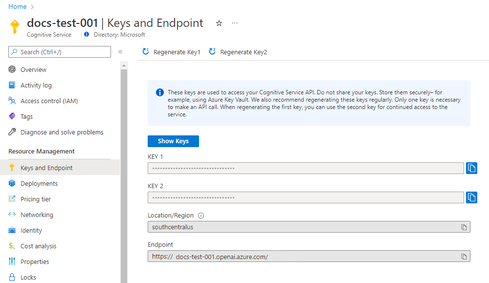
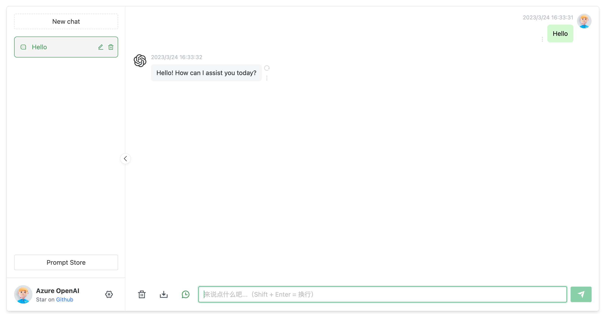

# azure-openai-proxy

[](https://opensource.org/licenses/Apache-2.0)
[](https://github.com/stulzq/azure-openai-proxy/releases/latest)
[](https://goreportcard.com/badge/github.com/stulzq/azure-openai-proxy)
[](https://github.com/stulzq/azure-openai-proxy/actions/workflows/ci.yml)
[](https://github.com/stulzq/azure-openai-proxy/actions/workflows/release.yml)
[](CONTRIBUTING.md)
[]([https://hub.docker.com/u/stulzq](https://hub.docker.com/r/stulzq/azure-openai-proxy/tags))

English|[中文](https://www.cnblogs.com/stulzq/p/17271937.html)

Azure OpenAI Service Proxy, convert OpenAI official API request to Azure OpenAI API request, support all models, support GPT-4,Embeddings.
>Eliminate the differences between OpenAI and Azure OpenAI, acting as a bridge connecting them, OpenAI ecosystem accesses Azure OpenAI at zero cost.


Verified support projects：

| Name                                                     | Status |
| -------------------------------------------------------- | ------ |
| [chatgpt-web](https://github.com/Chanzhaoyu/chatgpt-web) | √   |
| [chatbox](https://github.com/Bin-Huang/chatbox)          | √    |
| [langchain](https://python.langchain.com/en/latest/)     | √    |
| [ChatGPT-Next-Web](https://github.com/Yidadaa/ChatGPT-Next-Web) | √ |

## Get Start

### Retrieve key and endpoint

To successfully make a call against Azure OpenAI, you'll need the following:

| Name                  | Desc                                                         | Default                                                  |
| --------------------- | ------------------------------------------------------------ | ----------------------------- |
| AZURE_OPENAI_ENDPOINT | This value can be found in the **Keys & Endpoint** section when examining your resource from the Azure portal. Alternatively, you can find the value in **Azure OpenAI Studio** > **Playground** > **Code View**. An example endpoint is: `https://docs-test-001.openai.azure.com/`. | N |
| AZURE_OPENAI_API_VER  | [See here](https://learn.microsoft.com/en-us/azure/cognitive-services/openai/quickstart?tabs=command-line&pivots=rest-api) or Azure OpenAI Studio | 2023-07-01-preview |
| AZURE_OPENAI_MODEL_MAPPER   | This value will correspond to the custom name you chose for your deployment when you deployed a model. This value can be found under **Resource Management** > **Deployments** in the Azure portal or alternatively under **Management** > **Deployments** in Azure OpenAI Studio. | N |

`AZURE_OPENAI_MODEL_MAPPER` is a mapping from Azure OpenAI deployed model names to official OpenAI model names. You can use commas to separate multiple mappings.

**Format：**

`AZURE_OPENAI_MODEL_MAPPER`: \<OpenAI Model Name\>=\<Azure OpenAI deployment model name\>

OpenAI Model Names: https://platform.openai.com/docs/models

Azure Deployment Names: **Resource Management** > **Deployments**

**Example:**

````yaml
AZURE_OPENAI_MODEL_MAPPER: gpt-3.5-turbo=gpt-35-turbo
````



API Key: This value can be found in the **Keys & Endpoint** section when examining your resource from the Azure portal. You can use either `KEY1` or `KEY2`. 

### Proxy

**HTTP Proxy**

Env:

````shell
AZURE_OPENAI_HTTP_PROXY=http://127.0.0.1:1087
````


**Socks5 Proxy**

Env:

````shell
AZURE_OPENAI_SOCKS_PROXY=socks5://127.0.0.1:1080
````


### Use Docker

````shell
# config by environment 
docker run -d -p 8080:8080 --name=azure-openai-proxy \
  --env AZURE_OPENAI_ENDPOINT=your_azure_endpoint \
  --env AZURE_OPENAI_API_VER=your_azure_api_ver \
  --env AZURE_OPENAI_MODEL_MAPPER=your_azure_deploy_mapper \
  stulzq/azure-openai-proxy:latest

# config by file
docker run -d -p 8080:8080 --name=azure-openai-proxy \
  -v /path/to/config.yaml:/app/config.yaml \
  stulzq/azure-openai-proxy:latest
````

Call API:

````shell
curl --location --request POST 'localhost:8080/v1/chat/completions' \
-H 'Authorization: Bearer <Azure OpenAI Key>' \
-H 'Content-Type: application/json' \
-d '{
    "max_tokens": 1000,
    "model": "gpt-3.5-turbo",
    "temperature": 0.8,
    "top_p": 1,
    "presence_penalty": 1,
    "messages": [
        {
            "role": "user",
            "content": "Hello"
        }
    ],
    "stream": true
}'
````

### Use ChatGPT-Next-Web


docker-compose.yml

````yaml
version: '3'

services:
  chatgpt-web:
    image: yidadaa/chatgpt-next-web
    ports:
      - 3000:3000
    environment:
      OPENAI_API_KEY: <Azure OpenAI API Key>
      BASE_URL: http://azure-openai:8080
      CODE: ""
      HIDE_USER_API_KEY: 1
      HIDE_BALANCE_QUERY: 1
    depends_on:
      - azure-openai
    links:
      - azure-openai
    networks:
      - chatgpt-ns

  azure-openai:
    image: stulzq/azure-openai-proxy
    ports:
      - 8080:8080
    environment:
      AZURE_OPENAI_ENDPOINT: <Azure OpenAI API Endpoint>
      AZURE_OPENAI_MODEL_MAPPER: <Azure OpenAI API Deployment Mapper>
      # AZURE_OPENAI_MODEL_MAPPER: gpt-4=gpt-4,gpt-3.5-turbo=gpt-35-turbo
      AZURE_OPENAI_API_VER: 2023-07-01-preview
    networks:
      - chatgpt-ns

networks:
  chatgpt-ns:
    driver: bridge
````

### Use ChatGPT-Web

ChatGPT Web: https://github.com/Chanzhaoyu/chatgpt-web



Envs:

- `OPENAI_API_KEY` Azure OpenAI API Key
- `AZURE_OPENAI_ENDPOINT` Azure OpenAI API Endpoint
- `AZURE_OPENAI_MODEL_MAPPER` Azure OpenAI API Deployment Name Mappings

docker-compose.yml:

````yaml
version: '3'

services:
  chatgpt-web:
    image: chenzhaoyu94/chatgpt-web
    ports:
      - 3002:3002
    environment:
      OPENAI_API_KEY: <Azure OpenAI API Key>
      OPENAI_API_BASE_URL: http://azure-openai:8080
      # OPENAI_API_MODEL: gpt-4
      AUTH_SECRET_KEY: ""
      MAX_REQUEST_PER_HOUR: 1000
      TIMEOUT_MS: 60000
    depends_on:
      - azure-openai
    links:
      - azure-openai
    networks:
      - chatgpt-ns

  azure-openai:
    image: stulzq/azure-openai-proxy
    ports:
      - 8080:8080
    environment:
      AZURE_OPENAI_ENDPOINT: <Azure OpenAI API Endpoint>
      AZURE_OPENAI_MODEL_MAPPER: <Azure OpenAI API Deployment Mapper>
      AZURE_OPENAI_API_VER: 2023-07-01-preview
    networks:
      - chatgpt-ns

networks:
  chatgpt-ns:
    driver: bridge
````

Run:

````shell
docker compose up -d
````

### Use Config File

The configuration file supports different endpoints and API keys for each model.

config.yaml

````yaml
api_base: "/v1"
deployment_config:
  - deployment_name: "xxx"
    model_name: "text-davinci-003"
    endpoint: "https://xxx-east-us.openai.azure.com/"
    api_key: "11111111111"
    api_version: "2023-03-15-preview"
  - deployment_name: "yyy"
    model_name: "gpt-3.5-turbo"
    endpoint: "https://yyy.openai.azure.com/"
    api_key: "11111111111"
    api_version: "2023-03-15-preview"
  - deployment_name: "zzzz"
    model_name: "text-embedding-ada-002"
    endpoint: "https://zzzz.openai.azure.com/"
    api_key: "11111111111"
    api_version: "2023-03-15-preview"
````

By default, it reads `<workdir>/config.yaml`, and you can pass the path through the parameter `-c config.yaml`.

docker-compose:

````yaml
azure-openai:
    image: stulzq/azure-openai-proxy
    ports:
      - 8080:8080
    volumes:
      - /path/to/config.yaml:/app/config.yaml
    networks:
      - chatgpt-ns
````


